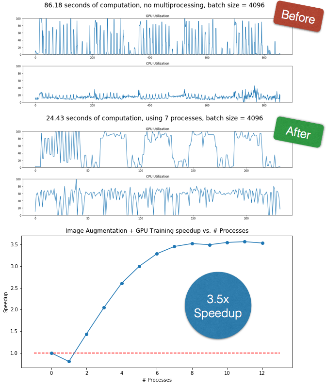

# Accelerating Deep Learning with Multiprocess Image Augmentation in Keras



**Code available @ https://github.com/stratospark/keras-multiprocess-image-data-generator**

* [Introduction](#Introduction)
* [Benchmark: CIFAR10 - In Memory Performance, Image Generation Only](#Benchmark:-CIFAR10---In-Memory-Performance,-Image-Generation-Only)
* [Benchmark: CIFAR10 - In Memory Performance, Image Generation with GPU Training](#Benchmark:-CIFAR10---In-Memory-Performance,-Image-Generation-with-GPU-Training)
* [Benchmark: Dogs vs. Cats - On Disk Performance, Image Generation witih GPU Training](#Benchmark:-Dogs-vs.-Cats---On-Disk-Performance,-Image-Generation-witih-GPU-Training)

## Introduction

**TLDR: By adding multiprocessing support to Keras ImageDataGenerator, benchmarking on a 6-core i7-6850K and 12GB TITAN X Pascal: 3.5x speedup of training with image augmentation on in memory datasets, 3.9x speedup of training with image augmentation on datasets streamed from disk.**

When exploring Deep Learning models, it isn't only beneficial to have good performance for the final training run. Accelerating training speed means more network models can be tried and more hyperparameter settings can be explored in the same amount of time. **The more that we can experiment, the better our results can become.**

In my experience with [training a moderately sized network](http://blog.stratospark.com/deep-learning-applied-food-classification-deep-learning-keras.html) on my home desktop, I found one bottleneck to be creating additional images to augment my dataset. Keras provides an [ImageDataGenerator](https://keras.io/preprocessing/image/) class that can take images, in memory or on disk, and create many different variations based on a set of parameters: rotations, flips, zooms, altering colors, etc. For reference, here is a [great tutorial](https://blog.keras.io/building-powerful-image-classification-models-using-very-little-data.html) on improving network accuracy with image augmentation.


While training my initial models, I was waiting upwards of an entire day to see enough results to decide what to change. I saw that I was taking nowhere near full advantage of my CPU or GPU. As a result, I decided to add some Python multiprocessing support to a fork of ImageDataGenerator. I was able to drastically cut my training time and was finally able to steer my experiments in the right direction!

For reference, I am using:
* Intel Core i7-6850K
* NVIDIA TITAN X Pascal 12GB
* 96GB RAM
* 64-bit Ubuntu 16.04
* Python 2.7.13 :: Continuum Analytics, Inc.
* Keras 1.2.1
* Tensorflow 0.12.1

You can use the multiprocessing-enabled ImageDataGenerator that is included with this repo as a drop-in replacement for the version that currently ships with Keras. If it makes sense, the code may get incorporated into the main branch at some point.


```python
import numpy as np
import pandas as pd
import keras as K
import matplotlib.pyplot as plt
import multiprocessing
import time
import collections
import sys
import signal

%matplotlib inline
```

    Using TensorFlow backend.


```python
# The original class can be imported like this:
# from keras.preprocessing.image import ImageDataGenerator

# We access the modified version through T.ImageDataGenerator
import tools.image as T

# Useful for checking the output of the generators after code change
try:
    from importlib import reload
    reload(T)
except:
    reload(T)
```

These are helper methods used throughout the notebook.


```python
def preprocess_img(img):
    img = img.astype(np.float32) / 255.0
    img -= 0.5
    return img * 2
```


```python
def plot_images(img_gen, title):
    fig, ax = plt.subplots(6, 6, figsize=(10, 10))
    plt.suptitle(title, size=32)
    plt.setp(ax, xticks=[], yticks=[])
    plt.tight_layout(rect=[0, 0.03, 1, 0.95])
    for (imgs, labels) in img_gen:
        for i in range(6):
            for j in range(6):
                if i*6 + j < 32:
                    ax[i][j].imshow(imgs[i*6 + j])
        break    
```

## Benchmark: CIFAR10 - In Memory Performance, Image Generation Only

[CIFAR10](https://www.cs.toronto.edu/~kriz/cifar.html) is a toy dataset that includes 50,000 training images and 10,000 test images of shape 32x32x3.

It includes the following 10 classes: **airplane, automobile, bird, cat, deer, dog, frog, horse, ship, truck**


```python
from keras.datasets.cifar10 import load_data
from keras.utils.np_utils import to_categorical

(X_train, y_train), (X_test, y_test) = load_data()

y_train_cat = to_categorical(y_train)
y_test_cat = to_categorical(y_test)
```

Here is an example of how to set up a `multiprocessing.Pool` and add it as an argument to the ImageDataGenerator constructor. This is the only change to the class' public interface. If you leave out the `pool` parameter or set it to `None`, the generator will operate in its original single process mode.


```python
try:
    pool.terminate()
except:
    pass
n_process = 4
    
pool = multiprocessing.Pool(processes=n_process)
start = time.time()
gen = T.ImageDataGenerator(
     featurewise_center=False,
     samplewise_center=False,
     featurewise_std_normalization=False,
     samplewise_std_normalization=False,
     zca_whitening=False,
     rotation_range=45,
     width_shift_range=.1,
     height_shift_range=.1,
     shear_range=0.,
     zoom_range=0,
     channel_shift_range=0,
     fill_mode='nearest',
     cval=0.,
     horizontal_flip=True,
     vertical_flip=False,
     rescale=1/255.,
     #preprocessing_function=preprocess_img, # disable for nicer visualization
     dim_ordering='default',
     pool=pool # <-------------- Only change needed!
)

gen.fit(X_train)
X_train_aug = gen.flow(X_train, y_train_cat, seed=0)

print('{} process, duration: {}'.format(4, time.time() - start))
plot_images(X_train_aug, 'Augmented Images generated with {} processes'.format(n_process))

pool.terminate()
```

    4 process, duration: 0.0404160022736


Now that we have verified that the images are being properly generated with multiple processes, we want to benchmark how the number of processes affects performance. Idealy, we would like to see speedups scale linearly with the number of processes added. However, as explained by [Amdahl's Law](https://en.wikipedia.org/wiki/Amdahl%27s_law), there are diminishing returns due to additional overhead.

The following benchmark will first test image augmentation without multiprocessing, then do a test for an increasing number of processes, up to a max of the number of logical CPUs your system has. It does multiple rounds of these tests so that we may average the results.


```python
durs = collections.defaultdict(list)
num_cores = 2
try:
    num_cores = multiprocessing.cpu_count()
except:
    pass

for j in range(10):
    print('Round', j)
    
    for num_p in range(0, num_cores + 1):
        pool = None
        if num_p > 0:
            pool = multiprocessing.Pool(processes=num_p)
            
        start = time.time()
        gen = T.ImageDataGenerator(
             featurewise_center=False,
             samplewise_center=False,
             featurewise_std_normalization=False,
             samplewise_std_normalization=False,
             zca_whitening=False,
             rotation_range=45,
             width_shift_range=.1,
             height_shift_range=.1,
             shear_range=0.,
             zoom_range=0,
             channel_shift_range=0,
             fill_mode='nearest',
             cval=0.,
             horizontal_flip=True,
             vertical_flip=False,
             rescale=None,
             preprocessing_function=preprocess_img,
             dim_ordering='default',
             pool=pool
        )

        gen.fit(X_train)
        X_train_aug = gen.flow(X_train, y_train_cat, seed=0)

        for i, (imgs, labels) in enumerate(X_train_aug):
            if i == 1000:
                break

        dur = time.time() - start
        #print(num_p, dur)
        sys.stdout.write('{}: {} ... '.format(num_p, dur))
        sys.stdout.flush()
        
        durs[num_p].append(dur)

        if pool:
            pool.terminate()
```

    ('Round', 0)
    0: 6.84576511383 ... 1: 9.6486890316 ... 2: 6.03799390793 ... 3: 4.88081693649 ... 4: 4.66870999336 ... 5: 3.70913481712 ... 6: 3.27630805969 ... 7: 3.48509907722 ... 8: 3.64657878876 ... 9: 3.74150896072 ... 10: 3.57441878319 ... 11: 3.60130214691 ... 12: 3.47499299049 ... ('Round', 1)
    0: 6.75701498985 ... 1: 9.94960093498 ... 2: 5.64250087738 ... 3: 5.06900811195 ... 4: 4.61409282684 ... 5: 4.57506585121 ... 6: 3.48270392418 ... 7: 3.51494693756 ... 8: 3.88235402107 ... 9: 3.62926697731 ... 10: 3.91224503517 ... 11: 3.59025716782 ... 12: 3.5045068264 ... ('Round', 2)
    0: 6.90472793579 ... 1: 9.55179905891 ... 2: 6.57418012619 ... 3: 5.2566280365 ... 4: 4.55560803413 ... 5: 4.45380306244 ... 6: 3.54513192177 ... 7: 3.21149206161 ... 8: 3.78789710999 ... 9: 3.67751908302 ... 10: 3.74882698059 ... 11: 3.98700881004 ... 12: 3.64187002182 ... ('Round', 3)
    0: 6.82807612419 ... 1: 9.48674917221 ... 2: 5.57596802711 ... 3: 4.74470591545 ... 4: 4.18711090088 ... 5: 3.89195489883 ... 6: 3.22924613953 ... 7: 3.17622900009 ... 8: 4.07523298264 ... 9: 3.59954690933 ... 10: 3.7366130352 ... 11: 3.52489495277 ... 12: 3.82451415062 ... ('Round', 4)
    0: 6.73704409599 ... 1: 9.2156291008 ... 2: 6.23566198349 ... 3: 5.13580393791 ... 4: 4.71229195595 ... 5: 3.35283398628 ... 6: 3.24846291542 ... 7: 3.79010605812 ... 8: 3.74294400215 ... 9: 3.76095604897 ... 10: 3.7142059803 ... 11: 3.54178500175 ... 12: 3.72024703026 ... ('Round', 5)
    0: 6.75245904922 ... 1: 10.7912859917 ... 2: 6.79878306389 ... 3: 4.67795395851 ... 4: 4.7692129612 ... 5: 3.99766302109 ... 6: 3.45177388191 ... 7: 3.30268979073 ... 8: 3.92767882347 ... 9: 3.69342398643 ... 10: 3.52480602264 ... 11: 3.46998000145 ... 12: 3.60531187057 ... ('Round', 6)
    0: 6.94973492622 ... 1: 9.72229290009 ... 2: 6.76698184013 ... 3: 5.28792905807 ... 4: 4.44634389877 ... 5: 4.34274101257 ... 6: 3.94904899597 ... 7: 3.34885692596 ... 8: 3.69488501549 ... 9: 3.87995219231 ... 10: 3.78279495239 ... 11: 3.49752092361 ... 12: 3.56351184845 ... ('Round', 7)
    0: 6.71522402763 ... 1: 10.2026801109 ... 2: 6.04175400734 ... 3: 5.20836210251 ... 4: 4.35653805733 ... 5: 4.39560294151 ... 6: 3.74392104149 ... 7: 3.19262504578 ... 8: 3.89874505997 ... 9: 3.41301083565 ... 10: 3.79124188423 ... 11: 3.90449810028 ... 12: 3.74271798134 ... ('Round', 8)
    0: 6.8355588913 ... 1: 9.49789810181 ... 2: 5.33640003204 ... 3: 5.41973185539 ... 4: 4.42942810059 ... 5: 4.30604100227 ... 6: 3.22810721397 ... 7: 3.24005103111 ... 8: 3.61394405365 ... 9: 3.50949716568 ... 10: 3.62207698822 ... 11: 3.84033894539 ... 12: 3.85311603546 ... ('Round', 9)
    0: 6.74057507515 ... 1: 10.3358399868 ... 2: 6.02810311317 ... 3: 5.41968894005 ... 4: 4.69001197815 ... 5: 3.6060628891 ... 6: 3.84348988533 ... 7: 3.67217493057 ... 8: 4.02522802353 ... 9: 3.74887800217 ... 10: 4.08099198341 ... 11: 3.81078886986 ... 12: 3.46359109879 ... 


```python
df = pd.DataFrame(durs)
df
```


<div>
<table border="1" class="dataframe">
  <thead>
    <tr style="text-align: right;">
      <th></th>
      <th>0</th>
      <th>1</th>
      <th>2</th>
      <th>3</th>
      <th>4</th>
      <th>5</th>
      <th>6</th>
      <th>7</th>
      <th>8</th>
      <th>9</th>
      <th>10</th>
      <th>11</th>
      <th>12</th>
    </tr>
  </thead>
  <tbody>
    <tr>
      <th>0</th>
      <td>6.845765</td>
      <td>9.648689</td>
      <td>6.037994</td>
      <td>4.880817</td>
      <td>4.668710</td>
      <td>3.709135</td>
      <td>3.276308</td>
      <td>3.485099</td>
      <td>3.646579</td>
      <td>3.741509</td>
      <td>3.574419</td>
      <td>3.601302</td>
      <td>3.474993</td>
    </tr>
    <tr>
      <th>1</th>
      <td>6.757015</td>
      <td>9.949601</td>
      <td>5.642501</td>
      <td>5.069008</td>
      <td>4.614093</td>
      <td>4.575066</td>
      <td>3.482704</td>
      <td>3.514947</td>
      <td>3.882354</td>
      <td>3.629267</td>
      <td>3.912245</td>
      <td>3.590257</td>
      <td>3.504507</td>
    </tr>
    <tr>
      <th>2</th>
      <td>6.904728</td>
      <td>9.551799</td>
      <td>6.574180</td>
      <td>5.256628</td>
      <td>4.555608</td>
      <td>4.453803</td>
      <td>3.545132</td>
      <td>3.211492</td>
      <td>3.787897</td>
      <td>3.677519</td>
      <td>3.748827</td>
      <td>3.987009</td>
      <td>3.641870</td>
    </tr>
    <tr>
      <th>3</th>
      <td>6.828076</td>
      <td>9.486749</td>
      <td>5.575968</td>
      <td>4.744706</td>
      <td>4.187111</td>
      <td>3.891955</td>
      <td>3.229246</td>
      <td>3.176229</td>
      <td>4.075233</td>
      <td>3.599547</td>
      <td>3.736613</td>
      <td>3.524895</td>
      <td>3.824514</td>
    </tr>
    <tr>
      <th>4</th>
      <td>6.737044</td>
      <td>9.215629</td>
      <td>6.235662</td>
      <td>5.135804</td>
      <td>4.712292</td>
      <td>3.352834</td>
      <td>3.248463</td>
      <td>3.790106</td>
      <td>3.742944</td>
      <td>3.760956</td>
      <td>3.714206</td>
      <td>3.541785</td>
      <td>3.720247</td>
    </tr>
    <tr>
      <th>5</th>
      <td>6.752459</td>
      <td>10.791286</td>
      <td>6.798783</td>
      <td>4.677954</td>
      <td>4.769213</td>
      <td>3.997663</td>
      <td>3.451774</td>
      <td>3.302690</td>
      <td>3.927679</td>
      <td>3.693424</td>
      <td>3.524806</td>
      <td>3.469980</td>
      <td>3.605312</td>
    </tr>
    <tr>
      <th>6</th>
      <td>6.949735</td>
      <td>9.722293</td>
      <td>6.766982</td>
      <td>5.287929</td>
      <td>4.446344</td>
      <td>4.342741</td>
      <td>3.949049</td>
      <td>3.348857</td>
      <td>3.694885</td>
      <td>3.879952</td>
      <td>3.782795</td>
      <td>3.497521</td>
      <td>3.563512</td>
    </tr>
    <tr>
      <th>7</th>
      <td>6.715224</td>
      <td>10.202680</td>
      <td>6.041754</td>
      <td>5.208362</td>
      <td>4.356538</td>
      <td>4.395603</td>
      <td>3.743921</td>
      <td>3.192625</td>
      <td>3.898745</td>
      <td>3.413011</td>
      <td>3.791242</td>
      <td>3.904498</td>
      <td>3.742718</td>
    </tr>
    <tr>
      <th>8</th>
      <td>6.835559</td>
      <td>9.497898</td>
      <td>5.336400</td>
      <td>5.419732</td>
      <td>4.429428</td>
      <td>4.306041</td>
      <td>3.228107</td>
      <td>3.240051</td>
      <td>3.613944</td>
      <td>3.509497</td>
      <td>3.622077</td>
      <td>3.840339</td>
      <td>3.853116</td>
    </tr>
    <tr>
      <th>9</th>
      <td>6.740575</td>
      <td>10.335840</td>
      <td>6.028103</td>
      <td>5.419689</td>
      <td>4.690012</td>
      <td>3.606063</td>
      <td>3.843490</td>
      <td>3.672175</td>
      <td>4.025228</td>
      <td>3.748878</td>
      <td>4.080992</td>
      <td>3.810789</td>
      <td>3.463591</td>
    </tr>
  </tbody>
</table>
</div>


```python
df_mean = pd.DataFrame(df.mean(axis=0))
plt.figure(figsize=(10,5))
plt.plot(df_mean, marker='o')
plt.xlabel('# Processes')
plt.ylabel('Seconds')
plt.title('Image Augmentation time vs. # Processes')
```


    <matplotlib.text.Text at 0x7fcd54312a10>


```python
speedups = 1 / (df_mean / df_mean[0][0])
plt.figure(figsize=(10,5))
plt.plot(speedups, marker='o')
plt.xlabel('# Processes')
plt.ylabel('Speedup')
plt.hlines(1, -1, df_mean.shape[0], colors='red', linestyles='dashed')
plt.title('Image Augmentation speedup vs. # Processes')
```


    <matplotlib.text.Text at 0x7fcd543f6950>


```python
best_ix = np.argmax(speedups.values)
print('Best speedup: {0:.2f}x with {1} processes.'.format(speedups.values[best_ix][0], best_ix))
```

    Best speedup: 2.01x with 7 processes.


As we can see, we are able to cut image generation time in half. However, does the speedup remain when we are also sending the images to the GPU for network trianing?

## Benchmark: CIFAR10 - In Memory Performance, Image Generation with GPU Training


```python
import tools.sysmonitor as SM
reload(SM)
```


    <module 'tools.sysmonitor' from 'tools/sysmonitor.pyc'>


Let us take a model from one of the [Keras examples](https://github.com/fchollet/keras/blob/master/examples/cifar10_cnn.py):


```python
from keras.models import Sequential
from keras.layers import Conv2D, Activation, MaxPooling2D, Dropout, Flatten, Dense

model = Sequential()
model.add(Conv2D(32, 3, 3, border_mode='same',
                        input_shape=(32, 32, 3)))
model.add(Activation('relu'))
model.add(Conv2D(32, 3, 3))
model.add(Activation('relu'))
model.add(MaxPooling2D(pool_size=(2, 2)))
model.add(Dropout(0.25))

model.add(Conv2D(64, 3, 3, border_mode='same'))
model.add(Activation('relu'))
model.add(Conv2D(64, 3, 3))
model.add(Activation('relu'))
model.add(MaxPooling2D(pool_size=(2, 2)))
model.add(Dropout(0.25))

model.add(Flatten())
model.add(Dense(512))
model.add(Activation('relu'))
model.add(Dropout(0.5))
model.add(Dense(10))
model.add(Activation('softmax'))

model.summary()
model.compile(optimizer='adam', loss='categorical_crossentropy', metrics=['accuracy'])
```

    ____________________________________________________________________________________________________
    Layer (type)                     Output Shape          Param #     Connected to                     
    ====================================================================================================
    convolution2d_8 (Convolution2D)  (None, 32, 32, 32)    896         convolution2d_input_3[0][0]      
    ____________________________________________________________________________________________________
    activation_12 (Activation)       (None, 32, 32, 32)    0           convolution2d_8[0][0]            
    ____________________________________________________________________________________________________
    convolution2d_9 (Convolution2D)  (None, 30, 30, 32)    9248        activation_12[0][0]              
    ____________________________________________________________________________________________________
    activation_13 (Activation)       (None, 30, 30, 32)    0           convolution2d_9[0][0]            
    ____________________________________________________________________________________________________
    maxpooling2d_6 (MaxPooling2D)    (None, 15, 15, 32)    0           activation_13[0][0]              
    ____________________________________________________________________________________________________
    dropout_5 (Dropout)              (None, 15, 15, 32)    0           maxpooling2d_6[0][0]             
    ____________________________________________________________________________________________________
    convolution2d_10 (Convolution2D) (None, 15, 15, 64)    18496       dropout_5[0][0]                  
    ____________________________________________________________________________________________________
    activation_14 (Activation)       (None, 15, 15, 64)    0           convolution2d_10[0][0]           
    ____________________________________________________________________________________________________
    convolution2d_11 (Convolution2D) (None, 13, 13, 64)    36928       activation_14[0][0]              
    ____________________________________________________________________________________________________
    activation_15 (Activation)       (None, 13, 13, 64)    0           convolution2d_11[0][0]           
    ____________________________________________________________________________________________________
    maxpooling2d_7 (MaxPooling2D)    (None, 6, 6, 64)      0           activation_15[0][0]              
    ____________________________________________________________________________________________________
    dropout_6 (Dropout)              (None, 6, 6, 64)      0           maxpooling2d_7[0][0]             
    ____________________________________________________________________________________________________
    flatten_3 (Flatten)              (None, 2304)          0           dropout_6[0][0]                  
    ____________________________________________________________________________________________________
    dense_5 (Dense)                  (None, 512)           1180160     flatten_3[0][0]                  
    ____________________________________________________________________________________________________
    activation_16 (Activation)       (None, 512)           0           dense_5[0][0]                    
    ____________________________________________________________________________________________________
    dropout_7 (Dropout)              (None, 512)           0           activation_16[0][0]              
    ____________________________________________________________________________________________________
    dense_6 (Dense)                  (None, 10)            5130        dropout_7[0][0]                  
    ____________________________________________________________________________________________________
    activation_17 (Activation)       (None, 10)            0           dense_6[0][0]                    
    ====================================================================================================
    Total params: 1,250,858
    Trainable params: 1,250,858
    Non-trainable params: 0
    ____________________________________________________________________________________________________


When we are running lengthier training sessions, we may want to interrupt training to try a different approach: tweak hyperparameters, choose a different optimizer, adjust the network architecture, etc. In order to handle this gracefully with multiprocessing, we need to tell the child processes to ignore the interrupt signals. The parent process will catch the KeyboardInterrupt exception allow us to continue working interactively in the Notebook. Without this infrastructure, the processes will remain in limbo as detailed [here](http://noswap.com/blog/python-multiprocessing-keyboardinterrupt).


```python
pool = None

def init_worker():
    signal.signal(signal.SIGINT, signal.SIG_IGN)
```


```python
def setup_generator(processes=None, batch_size=32):
    global pool
    try:
        pool.terminate()
    except:
        pass

    if processes: 
        pool = multiprocessing.Pool(processes=processes, initializer=init_worker)
    else:
        pool = None

    gen = T.ImageDataGenerator(
         featurewise_center=False,
         samplewise_center=False,
         featurewise_std_normalization=False,
         samplewise_std_normalization=False,
         zca_whitening=False,
         rotation_range=45,
         width_shift_range=.1,
         height_shift_range=.1,
         shear_range=0.,
         zoom_range=[.8, 1],
         channel_shift_range=20,
         fill_mode='nearest',
         cval=0.,
         horizontal_flip=True,
         vertical_flip=False,
         rescale=None,
         preprocessing_function=preprocess_img,
         dim_ordering='default',
         pool=pool
    )
    test_gen = T.ImageDataGenerator(
        preprocessing_function=preprocess_img,
        pool=pool
    )
    
    gen.fit(X_train)
    test_gen.fit(X_train)
    
    X_train_aug = gen.flow(X_train, y_train_cat, seed=0, batch_size=batch_size)
    X_test_aug = test_gen.flow(X_test, y_test_cat, seed=0, batch_size=batch_size)
    
    return X_train_aug, X_test_aug
```


```python
def run_benchmark(processes=None, batch_size=32, vert=True, plot=True):
    X_train_aug, X_test_aug = setup_generator(processes=processes, batch_size=batch_size)
    sys_mon = SM.SysMonitor()
    sys_mon.start()
    
    try:
        model.fit_generator(X_train_aug, samples_per_epoch=50000, nb_epoch=5, 
                        validation_data=X_test_aug, nb_val_samples=10000)
    except KeyboardInterrupt:
        print '\n\nTraining Interrupted\n'
        return None

    sys_mon.stop()
    
    title = None
    if not processes:
        title = '{0:.2f} seconds of computation, no multiprocessing, batch size = {1}'.format(sys_mon.duration, batch_size)
    else:
        title = '{0:.2f} seconds of computation, using {1} processes, batch size = {2}'.format(sys_mon.duration, processes, batch_size)
    
    if plot:
        sys_mon.plot(title, vert)
    
    if not processes:
        processes = 0
        
    return {
        'processes': processes,
        'batch_size': batch_size,
        'duration': sys_mon.duration,
        'title': title
    }
```


```python
run_benchmark(processes=None, batch_size=32)
```

    Epoch 1/5
     3552/50000 [=>............................] - ETA: 29s - loss: 2.1171 - acc: 0.2030
    
    Training Interrupted
    


```python
run_benchmark(processes=7, batch_size=32)
```

    Epoch 1/5
    11136/50000 [=====>........................] - ETA: 8s - loss: 1.8752 - acc: 0.3081
    
    Training Interrupted
    


Now let's try a variety of different test scenarios:


```python
runs = []
```


```python
runs.append(run_benchmark(processes=None, batch_size=32))
```

    Epoch 1/5
    50000/50000 [==============================] - 22s - loss: 1.1598 - acc: 0.5941 - val_loss: 0.8368 - val_acc: 0.7077
    Epoch 2/5
    50000/50000 [==============================] - 21s - loss: 1.1457 - acc: 0.6003 - val_loss: 0.8865 - val_acc: 0.6907
    Epoch 3/5
    50000/50000 [==============================] - 21s - loss: 1.1311 - acc: 0.6031 - val_loss: 0.8255 - val_acc: 0.7190
    Epoch 4/5
    50000/50000 [==============================] - 21s - loss: 1.1232 - acc: 0.6060 - val_loss: 0.8367 - val_acc: 0.7142
    Epoch 5/5
    50000/50000 [==============================] - 22s - loss: 1.1075 - acc: 0.6116 - val_loss: 0.8358 - val_acc: 0.7054


```python
runs.append(run_benchmark(processes=7, batch_size=32))
```

    Epoch 1/5
    50000/50000 [==============================] - 11s - loss: 1.0912 - acc: 0.6165 - val_loss: 0.8329 - val_acc: 0.7103
    Epoch 2/5
    50000/50000 [==============================] - 11s - loss: 1.0838 - acc: 0.6232 - val_loss: 0.8299 - val_acc: 0.7053
    Epoch 3/5
    50000/50000 [==============================] - 11s - loss: 1.0736 - acc: 0.6245 - val_loss: 0.8385 - val_acc: 0.7092
    Epoch 4/5
    50000/50000 [==============================] - 11s - loss: 1.0671 - acc: 0.6258 - val_loss: 0.7994 - val_acc: 0.7238
    Epoch 5/5
    50000/50000 [==============================] - 11s - loss: 1.0670 - acc: 0.6283 - val_loss: 0.8347 - val_acc: 0.7133


```python
runs[0]['duration'] / runs[1]['duration']
```


    1.8832975152491378


As we can see, we can get a **1.8x speedup by using 7 processes**. The GPU and CPU utilization is markedly higher and more consistent.

Let's see if batch size affects the outcome:


```python
runs.append(run_benchmark(processes=None, batch_size=256))
```

    Epoch 1/5
    50000/50000 [==============================] - 19s - loss: 1.0319 - acc: 0.6400 - val_loss: 0.7463 - val_acc: 0.7389
    Epoch 2/5
    50000/50000 [==============================] - 17s - loss: 1.0013 - acc: 0.6495 - val_loss: 0.7436 - val_acc: 0.7416
    Epoch 3/5
    50000/50000 [==============================] - 17s - loss: 0.9910 - acc: 0.6537 - val_loss: 0.7253 - val_acc: 0.7484
    Epoch 4/5
    50000/50000 [==============================] - 17s - loss: 0.9824 - acc: 0.6582 - val_loss: 0.7271 - val_acc: 0.7499
    Epoch 5/5
    50000/50000 [==============================] - 17s - loss: 0.9752 - acc: 0.6600 - val_loss: 0.6967 - val_acc: 0.7607


```python
runs.append(run_benchmark(processes=7, batch_size=256))
```

    Epoch 1/5
    50000/50000 [==============================] - 5s - loss: 0.9585 - acc: 0.6660 - val_loss: 0.7220 - val_acc: 0.7495
    Epoch 2/5
    50000/50000 [==============================] - 5s - loss: 0.9553 - acc: 0.6671 - val_loss: 0.7071 - val_acc: 0.7546
    Epoch 3/5
    50000/50000 [==============================] - 5s - loss: 0.9502 - acc: 0.6690 - val_loss: 0.6920 - val_acc: 0.7640
    Epoch 4/5
    50000/50000 [==============================] - 5s - loss: 0.9525 - acc: 0.6687 - val_loss: 0.7103 - val_acc: 0.7558
    Epoch 5/5
    50000/50000 [==============================] - 5s - loss: 0.9452 - acc: 0.6713 - val_loss: 0.6999 - val_acc: 0.7565


```python
runs[2]['duration'] / runs[3]['duration']
```


    3.3318531284663795


With a batch size of 256, we get an **even larger speedup of 3.3x**


```python
runs.append(run_benchmark(processes=None, batch_size=1024))
```

    Epoch 1/5
    50000/50000 [==============================] - 18s - loss: 0.9383 - acc: 0.6709 - val_loss: 0.6876 - val_acc: 0.7634
    Epoch 2/5
    50000/50000 [==============================] - 15s - loss: 0.9310 - acc: 0.6733 - val_loss: 0.6851 - val_acc: 0.7626
    Epoch 3/5
    50000/50000 [==============================] - 16s - loss: 0.9226 - acc: 0.6794 - val_loss: 0.6783 - val_acc: 0.7701
    Epoch 4/5
    50000/50000 [==============================] - 15s - loss: 0.9230 - acc: 0.6785 - val_loss: 0.6884 - val_acc: 0.7651
    Epoch 5/5
    50000/50000 [==============================] - 15s - loss: 0.9152 - acc: 0.6809 - val_loss: 0.6682 - val_acc: 0.7695


```python
runs.append(run_benchmark(processes=7, batch_size=1024))
```

    Epoch 1/5
    50000/50000 [==============================] - 5s - loss: 0.9137 - acc: 0.6815 - val_loss: 0.6798 - val_acc: 0.7661
    Epoch 2/5
    50000/50000 [==============================] - 4s - loss: 0.9161 - acc: 0.6814 - val_loss: 0.6771 - val_acc: 0.7649
    Epoch 3/5
    50000/50000 [==============================] - 4s - loss: 0.9125 - acc: 0.6812 - val_loss: 0.6759 - val_acc: 0.7691
    Epoch 4/5
    50000/50000 [==============================] - 4s - loss: 0.9133 - acc: 0.6814 - val_loss: 0.6786 - val_acc: 0.7673
    Epoch 5/5
    50000/50000 [==============================] - 4s - loss: 0.9139 - acc: 0.6812 - val_loss: 0.6574 - val_acc: 0.7707


```python
runs[4]['duration'] / runs[5]['duration']
```


    3.4816410549495163


With a batch size of 1024, we get **a speedup of 3.48%**. We also notice an interesting phenomenon. Without multiprocessing, the GPU is interittently going to 0 utilization. However, with 7 processes, we can see consistent >60% GPU utilization with a long initial period of >80%. Notice that with this batch size, we are able to get to lower losses a lot quicker than with lower batch sizes. This pattern will not necessarily continue with additional epochs, but it may be promising in some cases.


```python
runs.append(run_benchmark(processes=None, batch_size=4096))
```

    Epoch 1/5
    50000/50000 [==============================] - 19s - loss: 0.9059 - acc: 0.6812 - val_loss: 0.6704 - val_acc: 0.7696
    Epoch 2/5
    50000/50000 [==============================] - 16s - loss: 0.9116 - acc: 0.6829 - val_loss: 0.6654 - val_acc: 0.7666
    Epoch 3/5
    50000/50000 [==============================] - 14s - loss: 0.9002 - acc: 0.6867 - val_loss: 0.6626 - val_acc: 0.7719
    Epoch 4/5
    50000/50000 [==============================] - 16s - loss: 0.8984 - acc: 0.6863 - val_loss: 0.6678 - val_acc: 0.7688
    Epoch 5/5
    50000/50000 [==============================] - 15s - loss: 0.9041 - acc: 0.6847 - val_loss: 0.6647 - val_acc: 0.7663


```python
runs.append(run_benchmark(processes=7, batch_size=4096))
```

    Epoch 1/5
    50000/50000 [==============================] - 6s - loss: 0.9057 - acc: 0.6823 - val_loss: 0.6678 - val_acc: 0.7680
    Epoch 2/5
    50000/50000 [==============================] - 4s - loss: 0.9003 - acc: 0.6881 - val_loss: 0.6596 - val_acc: 0.7687
    Epoch 3/5
    50000/50000 [==============================] - 4s - loss: 0.8993 - acc: 0.6866 - val_loss: 0.6560 - val_acc: 0.7734
    Epoch 4/5
    50000/50000 [==============================] - 4s - loss: 0.9034 - acc: 0.6857 - val_loss: 0.6641 - val_acc: 0.7713
    Epoch 5/5
    50000/50000 [==============================] - 4s - loss: 0.9023 - acc: 0.6862 - val_loss: 0.6670 - val_acc: 0.7653


```python
runs[6]['duration'] / runs[7]['duration']
```


    3.4145451599892525


A larger batch size of 4096 may or may not be a good choice in all cases, but when it comes to measuring system performance, we can see that the GPU usage is not consistent in the single process case. On the other hand, we are getting between 80-100% GPU utilization with 7 processes.

Let's do a final experiment with this dataset to see how Image Augmentation + GPU Training time scales with process count:


```python
processes_counts = [None]
processes_counts.extend(range(1, 13))

results = []

for pc in processes_counts:
    print('process count', pc)
    results.append(run_benchmark(processes=pc, batch_size=4096, plot=False))
```

    ('process count', None)
    Epoch 1/5
    50000/50000 [==============================] - 19s - loss: 0.8994 - acc: 0.6885 - val_loss: 0.6619 - val_acc: 0.7704
    Epoch 2/5
    50000/50000 [==============================] - 15s - loss: 0.9035 - acc: 0.6864 - val_loss: 0.6609 - val_acc: 0.7706
    Epoch 3/5
    50000/50000 [==============================] - 15s - loss: 0.8930 - acc: 0.6883 - val_loss: 0.6613 - val_acc: 0.7730
    Epoch 4/5
    50000/50000 [==============================] - 17s - loss: 0.8894 - acc: 0.6879 - val_loss: 0.6648 - val_acc: 0.7705
    Epoch 5/5
    50000/50000 [==============================] - 14s - loss: 0.8942 - acc: 0.6870 - val_loss: 0.6639 - val_acc: 0.7706
    ('process count', 1)
    Epoch 1/5
    50000/50000 [==============================] - 26s - loss: 0.8941 - acc: 0.6873 - val_loss: 0.6590 - val_acc: 0.7727
    Epoch 2/5
    50000/50000 [==============================] - 19s - loss: 0.8953 - acc: 0.6900 - val_loss: 0.6597 - val_acc: 0.7690
    Epoch 3/5
    50000/50000 [==============================] - 18s - loss: 0.8889 - acc: 0.6888 - val_loss: 0.6528 - val_acc: 0.7775
    Epoch 4/5
    50000/50000 [==============================] - 20s - loss: 0.8924 - acc: 0.6879 - val_loss: 0.6627 - val_acc: 0.7714
    Epoch 5/5
    50000/50000 [==============================] - 21s - loss: 0.8962 - acc: 0.6873 - val_loss: 0.6599 - val_acc: 0.7704
    ('process count', 2)
    Epoch 1/5
    50000/50000 [==============================] - 15s - loss: 0.8916 - acc: 0.6884 - val_loss: 0.6598 - val_acc: 0.7725
    Epoch 2/5
    50000/50000 [==============================] - 11s - loss: 0.8925 - acc: 0.6888 - val_loss: 0.6544 - val_acc: 0.7716
    Epoch 3/5
    50000/50000 [==============================] - 11s - loss: 0.8869 - acc: 0.6898 - val_loss: 0.6505 - val_acc: 0.7768
    Epoch 4/5
    50000/50000 [==============================] - 11s - loss: 0.8917 - acc: 0.6895 - val_loss: 0.6578 - val_acc: 0.7735
    Epoch 5/5
    50000/50000 [==============================] - 11s - loss: 0.8890 - acc: 0.6888 - val_loss: 0.6614 - val_acc: 0.7701
    ('process count', 3)
    Epoch 1/5
    50000/50000 [==============================] - 10s - loss: 0.8788 - acc: 0.6938 - val_loss: 0.6580 - val_acc: 0.7730
    Epoch 2/5
    50000/50000 [==============================] - 7s - loss: 0.8887 - acc: 0.6901 - val_loss: 0.6564 - val_acc: 0.7694
    Epoch 3/5
    50000/50000 [==============================] - 7s - loss: 0.8817 - acc: 0.6919 - val_loss: 0.6488 - val_acc: 0.7756
    Epoch 4/5
    50000/50000 [==============================] - 7s - loss: 0.8852 - acc: 0.6923 - val_loss: 0.6549 - val_acc: 0.7731
    Epoch 5/5
    50000/50000 [==============================] - 7s - loss: 0.8833 - acc: 0.6904 - val_loss: 0.6574 - val_acc: 0.7729
    ('process count', 4)
    Epoch 1/5
    50000/50000 [==============================] - 8s - loss: 0.8780 - acc: 0.6919 - val_loss: 0.6539 - val_acc: 0.7742
    Epoch 2/5
    50000/50000 [==============================] - 6s - loss: 0.8839 - acc: 0.6914 - val_loss: 0.6511 - val_acc: 0.7696
    Epoch 3/5
    50000/50000 [==============================] - 5s - loss: 0.8782 - acc: 0.6936 - val_loss: 0.6481 - val_acc: 0.7741
    Epoch 4/5
    50000/50000 [==============================] - 5s - loss: 0.8792 - acc: 0.6940 - val_loss: 0.6529 - val_acc: 0.7736
    Epoch 5/5
    50000/50000 [==============================] - 6s - loss: 0.8844 - acc: 0.6907 - val_loss: 0.6586 - val_acc: 0.7713
    ('process count', 5)
    Epoch 1/5
    50000/50000 [==============================] - 7s - loss: 0.8776 - acc: 0.6930 - val_loss: 0.6514 - val_acc: 0.7749
    Epoch 2/5
    50000/50000 [==============================] - 5s - loss: 0.8779 - acc: 0.6919 - val_loss: 0.6521 - val_acc: 0.7697
    Epoch 3/5
    50000/50000 [==============================] - 5s - loss: 0.8692 - acc: 0.6957 - val_loss: 0.6453 - val_acc: 0.7769
    Epoch 4/5
    50000/50000 [==============================] - 5s - loss: 0.8792 - acc: 0.6944 - val_loss: 0.6520 - val_acc: 0.7753
    Epoch 5/5
    50000/50000 [==============================] - 5s - loss: 0.8804 - acc: 0.6926 - val_loss: 0.6561 - val_acc: 0.7738
    ('process count', 6)
    Epoch 1/5
    50000/50000 [==============================] - 6s - loss: 0.8702 - acc: 0.6945 - val_loss: 0.6512 - val_acc: 0.7739
    Epoch 2/5
    50000/50000 [==============================] - 4s - loss: 0.8708 - acc: 0.6949 - val_loss: 0.6470 - val_acc: 0.7715
    Epoch 3/5
    50000/50000 [==============================] - 4s - loss: 0.8686 - acc: 0.6964 - val_loss: 0.6417 - val_acc: 0.7766
    Epoch 4/5
    50000/50000 [==============================] - 4s - loss: 0.8683 - acc: 0.6966 - val_loss: 0.6495 - val_acc: 0.7763
    Epoch 5/5
    50000/50000 [==============================] - 4s - loss: 0.8692 - acc: 0.6997 - val_loss: 0.6525 - val_acc: 0.7752
    ('process count', 7)
    Epoch 1/5
    50000/50000 [==============================] - 6s - loss: 0.8676 - acc: 0.6960 - val_loss: 0.6477 - val_acc: 0.7746
    Epoch 2/5
    50000/50000 [==============================] - 4s - loss: 0.8634 - acc: 0.6985 - val_loss: 0.6442 - val_acc: 0.7714
    Epoch 3/5
    50000/50000 [==============================] - 4s - loss: 0.8656 - acc: 0.6988 - val_loss: 0.6398 - val_acc: 0.7769
    Epoch 4/5
    50000/50000 [==============================] - 4s - loss: 0.8694 - acc: 0.6967 - val_loss: 0.6495 - val_acc: 0.7749
    Epoch 5/5
    50000/50000 [==============================] - 4s - loss: 0.8617 - acc: 0.6994 - val_loss: 0.6511 - val_acc: 0.7761
    ('process count', 8)
    Epoch 1/5
    50000/50000 [==============================] - 5s - loss: 0.8600 - acc: 0.6989 - val_loss: 0.6462 - val_acc: 0.7754
    Epoch 2/5
    50000/50000 [==============================] - 4s - loss: 0.8620 - acc: 0.6997 - val_loss: 0.6404 - val_acc: 0.7743
    Epoch 3/5
    50000/50000 [==============================] - 4s - loss: 0.8563 - acc: 0.6982 - val_loss: 0.6389 - val_acc: 0.7768
    Epoch 4/5
    50000/50000 [==============================] - 4s - loss: 0.8639 - acc: 0.6981 - val_loss: 0.6457 - val_acc: 0.7772
    Epoch 5/5
    50000/50000 [==============================] - 4s - loss: 0.8653 - acc: 0.6995 - val_loss: 0.6504 - val_acc: 0.7762
    ('process count', 9)
    Epoch 1/5
    50000/50000 [==============================] - 5s - loss: 0.8581 - acc: 0.6996 - val_loss: 0.6442 - val_acc: 0.7769
    Epoch 2/5
    50000/50000 [==============================] - 4s - loss: 0.8603 - acc: 0.6989 - val_loss: 0.6437 - val_acc: 0.7727
    Epoch 3/5
    50000/50000 [==============================] - 4s - loss: 0.8557 - acc: 0.7032 - val_loss: 0.6374 - val_acc: 0.7794
    Epoch 4/5
    50000/50000 [==============================] - 4s - loss: 0.8620 - acc: 0.6998 - val_loss: 0.6439 - val_acc: 0.7776
    Epoch 5/5
    50000/50000 [==============================] - 4s - loss: 0.8594 - acc: 0.6969 - val_loss: 0.6474 - val_acc: 0.7774
    ('process count', 10)
    Epoch 1/5
    50000/50000 [==============================] - 5s - loss: 0.8528 - acc: 0.7036 - val_loss: 0.6420 - val_acc: 0.7759
    Epoch 2/5
    50000/50000 [==============================] - 4s - loss: 0.8518 - acc: 0.7028 - val_loss: 0.6378 - val_acc: 0.7756
    Epoch 3/5
    50000/50000 [==============================] - 4s - loss: 0.8491 - acc: 0.7034 - val_loss: 0.6332 - val_acc: 0.7793
    Epoch 4/5
    50000/50000 [==============================] - 4s - loss: 0.8555 - acc: 0.7023 - val_loss: 0.6421 - val_acc: 0.7777
    Epoch 5/5
    50000/50000 [==============================] - 4s - loss: 0.8520 - acc: 0.7011 - val_loss: 0.6459 - val_acc: 0.7750
    ('process count', 11)
    Epoch 1/5
    50000/50000 [==============================] - 5s - loss: 0.8518 - acc: 0.7010 - val_loss: 0.6389 - val_acc: 0.7795
    Epoch 2/5
    50000/50000 [==============================] - 4s - loss: 0.8506 - acc: 0.7038 - val_loss: 0.6398 - val_acc: 0.7746
    Epoch 3/5
    50000/50000 [==============================] - 4s - loss: 0.8438 - acc: 0.7056 - val_loss: 0.6339 - val_acc: 0.7812
    Epoch 4/5
    50000/50000 [==============================] - 4s - loss: 0.8553 - acc: 0.7020 - val_loss: 0.6393 - val_acc: 0.7784
    Epoch 5/5
    50000/50000 [==============================] - 4s - loss: 0.8475 - acc: 0.7057 - val_loss: 0.6449 - val_acc: 0.7785
    ('process count', 12)
    Epoch 1/5
    50000/50000 [==============================] - 5s - loss: 0.8450 - acc: 0.7028 - val_loss: 0.6371 - val_acc: 0.7784
    Epoch 2/5
    50000/50000 [==============================] - 4s - loss: 0.8444 - acc: 0.7047 - val_loss: 0.6353 - val_acc: 0.7773
    Epoch 3/5
    50000/50000 [==============================] - 4s - loss: 0.8418 - acc: 0.7074 - val_loss: 0.6290 - val_acc: 0.7809
    Epoch 4/5
    50000/50000 [==============================] - 4s - loss: 0.8447 - acc: 0.7049 - val_loss: 0.6392 - val_acc: 0.7783
    Epoch 5/5
    50000/50000 [==============================] - 4s - loss: 0.8457 - acc: 0.7011 - val_loss: 0.6417 - val_acc: 0.7781


```python
durs_4096 = pd.DataFrame([x['duration'] for x in results])
plt.figure(figsize=(10,5))
plt.plot(durs_4096, marker='o')
plt.xlabel('# Processes')
plt.ylabel('Seconds')
plt.title('Image Augmentation + GPU Training time vs. # Processes')
```


    <matplotlib.text.Text at 0x7fcd485fec90>


```python
speedups_4096 = 1 / (durs_4096 / durs_4096.ix[0])

plt.figure(figsize=(10,5))
plt.plot(speedups_4096, marker='o')
plt.xlabel('# Processes')
plt.ylabel('Speedup')
plt.hlines(1, -1, speedups_4096.shape[0], colors='red', linestyles='dashed')
plt.title('Image Augmentation + GPU Training speedup vs. # Processes')
```


    <matplotlib.text.Text at 0x7fcd48790c90>


```python
best_ix = np.argmax(speedups_4096.values)
print('Best speedup: {0:.2f}x with {1} processes.'.format(speedups_4096.values[best_ix][0], best_ix))
```

    Best speedup: 3.51x with 9 processes.


## Benchmark: Dogs vs. Cats - On Disk Performance, Image Generation witih GPU Training

Using the images in the [dogs vs. cats dataset](https://www.kaggle.com/c/dogs-vs-cats/data) provided by Kaggle, we can test the performance of image augmentation on images loaded from disk on the fly.

To follow along, unzip the downloaded training zip file, then create a `data/train/cat`, `/data/train/dog`, `data/validation/cat`, and `data/validation/dog` folders. 

Then move the images that have indicies starting with 8 into the appropriate validation folders.

`
mv cat.8* data/validation/cat/
mv dog.8* data/validation/dog/
`


```python
import os

paths = sorted(os.listdir('./data/train/cat'))

fig, ax = plt.subplots(5, 5, figsize=(15, 15))
for i in range(5):
    for j in range(5):
        ix = i*5 + j
        img = plt.imread('./data/train/cat/' + paths[ix])
        ax[i][j].imshow(img)

```


```python
paths = sorted(os.listdir('./data/train/dog'))

fig, ax = plt.subplots(5, 5, figsize=(15, 15))
for i in range(5):
    for j in range(5):
        ix = i*5 + j
        img = plt.imread('./data/train/dog/' + paths[ix])
        ax[i][j].imshow(img)

```


```python
gen = T.ImageDataGenerator(
     featurewise_center=False,
     samplewise_center=False,
     featurewise_std_normalization=False,
     samplewise_std_normalization=False,
     zca_whitening=False,
     rotation_range=45,
     width_shift_range=.1,
     height_shift_range=.1,
     shear_range=0.,
     zoom_range=[.8, 1],
     channel_shift_range=0,
     fill_mode='nearest',
     cval=0.,
     horizontal_flip=True,
     vertical_flip=False,
     rescale=1/255.,
#      preprocessing_function=preprocess_img,
     #dim_ordering='default',
#      pool=None
)
test_gen = T.ImageDataGenerator(
    preprocessing_function=preprocess_img,
#     pool=None
)


train_generator = gen.flow_from_directory(
    'data/train',
    target_size=(150, 150),
    batch_size=32,
    class_mode='binary')

test_generator = gen.flow_from_directory(
    'data/validation',
    target_size=(150, 150),
    batch_size=32,
    class_mode='binary')

fig, ax = plt.subplots(6, 6, figsize=(15, 15))
for (imgs, labels) in train_generator:
    for i in range(6):
        for j in range(6):
            if i*6 + j < 32:
                ax[i][j].imshow(imgs[i*6 + j])
    break

```

    Found 22778 images belonging to 2 classes.
    Found 2222 images belonging to 2 classes.


```python
from keras.models import Sequential
from keras.layers import Convolution2D, MaxPooling2D
from keras.layers import Activation, Dropout, Flatten, Dense

model = Sequential()
model.add(Convolution2D(32, 3, 3, input_shape=(299, 299, 3)))
model.add(Activation('relu'))
model.add(MaxPooling2D(pool_size=(2, 2)))

model.add(Convolution2D(32, 3, 3))
model.add(Activation('relu'))
model.add(MaxPooling2D(pool_size=(2, 2)))

model.add(Convolution2D(64, 3, 3))
model.add(Activation('relu'))
model.add(MaxPooling2D(pool_size=(2, 2)))

model.add(Flatten())  # this converts our 3D feature maps to 1D feature vectors
model.add(Dense(64))
model.add(Activation('relu'))
model.add(Dropout(0.5))
model.add(Dense(1))
model.add(Activation('sigmoid'))

model.compile(loss='binary_crossentropy',
              optimizer='rmsprop',
              metrics=['accuracy'])

```


```python
def setup_cat_dog_generator(processes=None, batch_size=32):
    global pool
    try:
        pool.terminate()
    except:
        pass

    if processes: 
        pool = multiprocessing.Pool(processes=processes, initializer=init_worker)
    else:
        pool = None

    gen = T.ImageDataGenerator(
         featurewise_center=False,
         samplewise_center=False,
         featurewise_std_normalization=False,
         samplewise_std_normalization=False,
         zca_whitening=False,
         rotation_range=45,
         width_shift_range=.1,
         height_shift_range=.1,
         shear_range=0.,
         zoom_range=[.8, 1],
         channel_shift_range=20,
         fill_mode='nearest',
         cval=0.,
         horizontal_flip=True,
         vertical_flip=False,
         rescale=None,
         preprocessing_function=preprocess_img,
         dim_ordering='default',
         pool=pool
    )
    test_gen = T.ImageDataGenerator(
        preprocessing_function=preprocess_img,
        pool=pool
    )
    
    gen.fit(X_train)
    test_gen.fit(X_train)
    
    X_train_aug = gen.flow_from_directory(
        'data/train',
        target_size=(299, 299),
        batch_size=batch_size,
        class_mode='binary')

    X_test_aug = gen.flow_from_directory(
        'data/validation',
        target_size=(299, 299),
        batch_size=batch_size,
        class_mode='binary')
    
    return X_train_aug, X_test_aug
```


```python
def run_cat_dog_benchmark(processes=None, batch_size=32, vert=True, plot=True):
    
    X_train_aug, X_test_aug = setup_cat_dog_generator(processes=processes, batch_size=batch_size)
    sys_mon = SM.SysMonitor()
    sys_mon.start()
    
    try:        
        model.fit_generator(
                X_train_aug,
                samples_per_epoch=22778,
                nb_epoch=2,
                validation_data=X_test_aug,
                nb_val_samples=2222)
    except KeyboardInterrupt:
        print '\n\nTraining Interrupted\n'
        return None

    sys_mon.stop()
    
    title = None
    if not processes:
        title = '{0:.2f} seconds of computation, no multiprocessing, batch size = {1}'.format(sys_mon.duration, batch_size)
    else:
        title = '{0:.2f} seconds of computation, using {1} processes, batch size = {2}'.format(sys_mon.duration, processes, batch_size)
    
    if plot:
        sys_mon.plot(title, vert)
    
    if not processes:
        processes = 0
        
    return {
        'processes': processes,
        'batch_size': batch_size,
        'duration': sys_mon.duration,
        'title': title
    }
```

In the following benchmark runs, you can see how inconsistent the GPU is being used without multiprocessing. Even with multiprocessing, the CPU is struggling to get enough data to the GPU to keep the GPU utilization stable. However, it's averaging out to be much higher than before.

Before running each benchmark, I run: 

`sync; echo 3 > /proc/sys/vm/drop_caches` 

in the shell. This clears any diles that may be cached in memory that could be skewing the benchmarking results.


```python
runs = []
```


```python
runs.append(run_cat_dog_benchmark(processes=None, batch_size=64))
```

    Found 22778 images belonging to 2 classes.
    Found 2222 images belonging to 2 classes.
    Epoch 1/2
    22778/22778 [==============================] - 326s - loss: 0.6311 - acc: 0.6492 - val_loss: 0.5449 - val_acc: 0.7151
    Epoch 2/2
    22778/22778 [==============================] - 313s - loss: 0.5782 - acc: 0.7043 - val_loss: 0.5174 - val_acc: 0.7480


```python
runs.append(run_cat_dog_benchmark(processes=7, batch_size=64))
```

    Found 22778 images belonging to 2 classes.
    Found 2222 images belonging to 2 classes.
    Epoch 1/2
    22778/22778 [==============================] - 90s - loss: 0.5475 - acc: 0.7274 - val_loss: 0.4989 - val_acc: 0.7610
    Epoch 2/2
    22778/22778 [==============================] - 87s - loss: 0.5318 - acc: 0.7417 - val_loss: 0.4973 - val_acc: 0.7610


```python
runs.append(run_cat_dog_benchmark(processes=11, batch_size=64))
```

    Found 22778 images belonging to 2 classes.
    Found 2222 images belonging to 2 classes.
    Epoch 1/2
    22778/22778 [==============================] - 81s - loss: 0.5181 - acc: 0.7514 - val_loss: 0.5052 - val_acc: 0.7520
    Epoch 2/2
    22778/22778 [==============================] - 80s - loss: 0.5086 - acc: 0.7591 - val_loss: 0.4665 - val_acc: 0.7691


```python
runs[0]['duration'] / runs[2]['duration']
```


    3.9467718654410233


As we can see, we can get an even bigger performance gain when flowing from disk. Using 11 processes, we are getting 3.94x performance over single threaded. This will really help a lot when working with larger than memory datasets.
